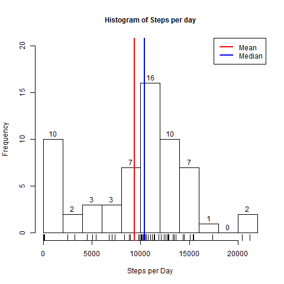

## Loading and preprocessing the data

The following code loads the data, and creates new date and time fields to ease future processing.  


```r
unzip("activity.zip")
activity = read.csv("activity.csv")
activity$date <- as.Date(activity$date, format = "%Y-%m-%d")
activity$hour <- activity$interval %/% 100
activity$minute <- activity$interval - (activity$hour * 100)
activity$time <- activity$hour * 60 * 60 + activity$minute * 60
    activity$time <- hms::as.hms(activity$time)
activity$date_time <- as.POSIXct(paste(activity$date, activity$time), format="%Y-%m-%d %H:%M:%S")
#head(activity)
```

## What is mean total number of steps taken per day?

The code below calculates the total steps taken per day, and prints out the total steps for the first six days.   


```r
activity_date <- group_by(activity,date)
activity_date <- summarise(activity_date,steps_sum = sum(steps,na.rm = TRUE))
head(activity_date)
```

```
## # A tibble: 6 x 2
##   date       steps_sum
##   <date>         <int>
## 1 2012-10-01         0
## 2 2012-10-02       126
## 3 2012-10-03     11352
## 4 2012-10-04     12116
## 5 2012-10-05     13294
## 6 2012-10-06     15420
```

The code below generates a histogram of the total steps taken per day.   


```r
png('figure/plot1.png')
par(mar=c(5.1,4.1,4.5,2.1))
hist(activity_date$steps_sum, breaks = 15, main= "Histogram of Steps per day", cex.main=1,
     xlab="Steps per Day", labels = TRUE, ylim= c(0,20)
     )
rug(activity_date$steps_sum)
abline(v=mean(activity_date$steps_sum),col="red",lwd=2)
abline(v=median(activity_date$steps_sum),col="blue",lwd=2)
legend(x = "topright", 
 c("Mean", "Median"),
 col = c("red", "blue"),
 lwd = c(2, 2))
dev.off()
```

```
## png 
##   2
```




Find the mean steps per day:

```r
mean(activity_date$steps_sum)
```

```
## [1] 9354.23
```


Find the median steps per day:

```r
median(activity_date$steps_sum)
```

```
## [1] 10395
```


## What is the average daily activity pattern?
The code below creates the average daily activity pattern:


```r
activity_minute <- group_by(activity,interval)
activity_minute <- summarise(activity_minute,steps_mean = mean(steps,na.rm = TRUE))

png('figure/plot2.png')
plot(x = activity_minute$interval,y = activity_minute$steps_mean,type = "l", main = "Daily activity pattern", xlab = "Time of Day", ylab = "average steps in 5 minute interval")

dev.off()
```

```
## png 
##   2
```


Which 5 minute interval, on average across all days in the dataset, contains the maximum number of steps?


```r
max_steps <- filter(activity_minute,steps_mean  == max(steps_mean))
```

```
## Warning: package 'bindrcpp' was built under R version 3.4.3
```

```r
max_steps[1,1]
```

```
## # A tibble: 1 x 1
##   interval
##      <int>
## 1      835
```
This finds that on average across all days in the dataset, 8:35 AM has the highest average number of steps out of all of the other 5 minute intervals in a day.  The average number of steps taken during this 5-minute interval is 206.  

## Imputing missing values

How many missing values are in the original dataset? 

```r
sum(is.na(activity$steps))
```

```
## [1] 2304
```

What is the percentage of missing values in the original dataset? 

```r
sum(is.na(activity$steps))/nrow(activity)
```

```
## [1] 0.1311475
```

The following code creates a new column of data where the original data is filled in by the averae 5-minute data, if the original data is not available.   


```r
activity_filled <- left_join(activity,activity_minute,by = "interval")
activity_filled$steps_clean <- ifelse(is.na(activity_filled$steps),activity_filled$steps_mean,activity_filled$steps)
```

The following code plots a new version of the histogram, but with the imputed values.   


```r
activity_date2 <- group_by(activity_filled,date)
activity_date2 <- summarise(activity_date2,steps_sum = sum(steps_clean,na.rm = TRUE))
head(activity_date2)
```

```
## # A tibble: 6 x 2
##   date       steps_sum
##   <date>         <dbl>
## 1 2012-10-01     10766
## 2 2012-10-02       126
## 3 2012-10-03     11352
## 4 2012-10-04     12116
## 5 2012-10-05     13294
## 6 2012-10-06     15420
```

```r
png('figure/plot3.png')
par(mar=c(5.1,4.1,4.5,2.1))
hist(activity_date2$steps_sum, breaks = 15, main= "Histogram of Steps per Day - Imputed NAs", cex.main=1,
     xlab="Steps per Day", labels = TRUE, ylim= c(0,30)
     )
rug(activity_date2$steps_sum)
abline(v=mean(activity_date2$steps_sum),col="red",lwd=5)
abline(v=median(activity_date2$steps_sum),col="blue",lwd=2, lty = "dashed")
legend(x = "topright", 
 c("Mean", "Median"),
 col = c("red", "blue"),
 lwd = c(2, 2),
  lty = c(1,2))
dev.off()
```

```
## png 
##   2
```


Find the new mean steps per day:

```r
mean(activity_date2$steps_sum)
```

```
## [1] 10766.19
```

Find the median steps per day:

```r
median(activity_date2$steps_sum)
```

```
## [1] 10766.19
```

## Are there differences in activity patterns between weekdays and weekends?

The following code classifies the data into weekend and weekday values, and plots the average steps taken over a 5 minute period, for each 5 minute period of the day.   


```r
activity_filled$weekday <- weekdays(activity_filled$date)
activity_filled$day_type <- ifelse(activity_filled$weekday == "Saturday" | activity_filled$weekday == "Sunday","Weekend","Weekday")
activity_filled$day_type <- as.factor(activity_filled$day_type)

weekend <- filter(activity_filled,day_type == "Weekend")
weekday <- filter(activity_filled,day_type == "Weekday")

weekend_minute <- group_by(weekend,interval)
weekday_minute <- group_by(weekday,interval)

weekend_minute <- summarise(weekend_minute,steps_mean = mean(steps_clean))
weekday_minute <- summarise(weekday_minute, steps_mean = mean(steps_clean))

png('figure/plot4.png')
par(mfrow = c(2,1))
plot(x = weekend_minute$interval,y = weekend_minute$steps_mean,type = "l", main = "Weekend", xlab = "Time of Day", ylab = "Steps")
plot(x=weekday_minute$interval,y=weekday_minute$steps_mean,type = "l",main = "Weekday", xlab = "Time of Day", ylab = "Steps")
dev.off()
```

```
## png 
##   2
```


